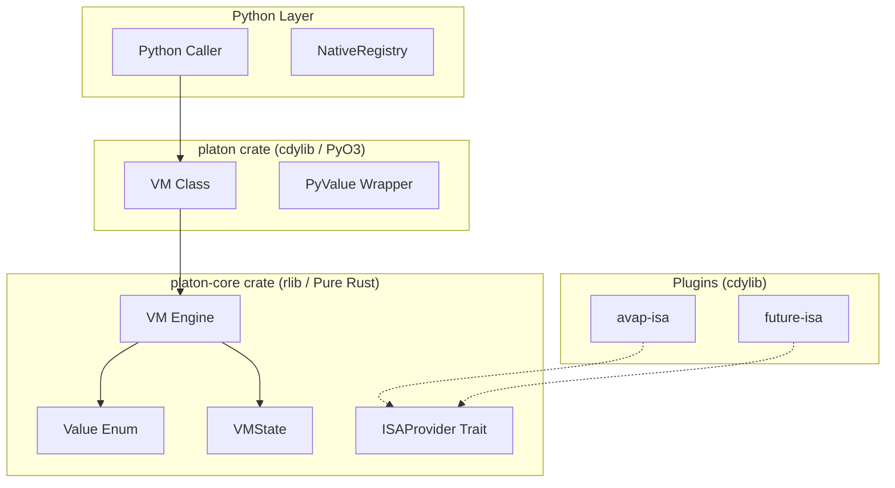

# Architecture

*Author: Rafael Ruiz, CTO — The Platon Foundation*
*Version: 0.3.0 — 2026-03-22*

---

## Overview

Platon is structured as a two-crate Cargo workspace. The design principle is **strict layering**: the kernel core has zero Python dependency; Python bindings are an additive layer on top.



---

## Execution Flow

```
1. vm.load(bytecode)
   ├── validate magic b"AVBC"
   ├── parse header (code_size, const_count, entry_point)
   ├── decode constant pool → VMState.constants
   └── copy instruction stream → VM.code

2. vm.register_isa(isa_obj)
   ├── call isa_obj._get_arc_ptr() → (u64, u64)
   └── transmute → Arc<dyn ISAProvider> → VM.isa

3. vm.globals = {...}
   └── inject initial state into VMState.globals

4. vm.execute(registry=reg)
   ├── build Py<PyDict> from NativeRegistry
   ├── store as VMState.registry_ptr
   ├── acquire py_ctx = &py as *mut ()
   │
   └── LOOP:
       ├── timeout check → TimeoutError
       ├── instruction count check → VMError
       ├── read opcode, check halt
       ├── lookup in ISA InstructionSet → VMError if unknown
       ├── call handler(state, code, &mut ip, py_ctx)
       │     ↳ on error + try_stack non-empty: push err, jump to handler
       │     ↳ on error + try_stack empty: → VMError
       └── count++

5. cleanup: free registry_ptr
6. return: stack.last() or Null

7. caller reads: vm.globals, vm.conector_vars, vm.results
```

---

## ISA Registration Protocol

The fat pointer protocol for transferring `Arc<dyn ISAProvider>` across the PyO3 boundary:

```
AvapISA Python object
    │
    │ _get_arc_ptr()
    │
    ▼
Arc<dyn ISAProvider>::clone()    ← increments refcount
    │
    │ Arc::into_raw()
    ▼
*const dyn ISAProvider           ← fat pointer (data_ptr, vtable_ptr)
    │
    │ transmute
    ▼
(u64, u64)                       ← returned to Python

Python calls vm.register_isa((data_ptr, vtable_ptr))
    │
    │ transmute back
    ▼
*const dyn ISAProvider
    │
    │ Arc::from_raw()             ← takes ownership, refcount balanced
    ▼
Arc<dyn ISAProvider> stored in VM.isa
```

---

## Memory Model

- All values are owned — no garbage collector
- `Value` is `Clone` — all operations produce owned values
- `VMState.stack` grows dynamically; shrinks as values are consumed
- `VMState.globals` persists across the full `execute()` call
- `VMState.registry_ptr`: `Box<Py<PyDict>>` allocated before execute(), freed after
- `VM.isa`: `Arc<dyn ISAProvider>` — shared with the ISA Python object; dropped when VM is dropped

---

## unsafe Inventory

| Location | Purpose | Safety Invariant |
|---|---|---|
| `register_isa()` | Fat pointer transmute | `_get_arc_ptr()` called once per `register_isa()`; Arc refcount pre-incremented |
| `execute()` cleanup | `Box::from_raw(registry_ptr)` | Set via `Box::into_raw` in same `execute()` call; freed exactly once |
| `VMState unsafe impl Send/Sync` | Allow `Arc<dyn ISAProvider>` | Single-threaded access within execute(); GIL held |

---

## Documentation Registry

### Product Requirements (PRDs)
- [PRD-001: Platon VM Kernel](docs/PRD/PRD-001-platon-kernel.md) - Initial vision and technical requirements.

### Architecture Decision Records (ADRs)
- [ADR-001: Two-Crate Workspace](docs/ADR/ADR-001-two-crate-workspace.md) - Decision on the Rust workspace structure.
- [ADR-002: Value as Tagged-Union Enum](docs/ADR/ADR-002-value-as-enum.md) - Decision on the type system and copy semantics.
- [ADR-003: ISA Provider Trait](docs/ADR/ADR-003-isa-provider-trait.md) - Trait design for ISA plugin interface.
- [ADR-004: Fat Pointer Protocol](docs/ADR/ADR-004-fat-pointer-protocol.md) - Protocol for transferring Arc<dyn ISAProvider> across PyO3 boundary.
- [ADR-005: Registry Ptr as Raw Pointer](docs/ADR/ADR-005-registry-ptr-as-raw-pointer.md) - Raw pointer strategy for registry passing.
- [ADR-006: VMState Send/Sync](docs/ADR/ADR-006-vmstate-send-sync.md) - Thread safety considerations for VMState.
- [ADR-007: Conector Namespaces](docs/ADR/ADR-007-conector-namespaces.md) - Namespace design for connector variables.
- [ADR-008: Bytecode Loader](docs/ADR/ADR-008-bytecode-loader.md) - Design of the bytecode loading mechanism.
- [ADR-009: PyO3 Exception Hierarchy](docs/ADR/ADR-009-pyo3-exception-hierarchy.md) - Exception mapping strategy for Python.
- [ADR-010: Debug Trace](docs/ADR/ADR-010-debug-trace.md) - Debugging and tracing capabilities.
- [ADR-011: Stack Machine Architecture](docs/ADR/ADR-011-stack-machine-architecture.md) - Stack-based execution model.
- [ADR-012: AVBC Binary Format](docs/ADR/ADR-012-avbc-binary-format.md) - Binary format specification for bytecode.
- [ADR-013: Dual Security Limits](docs/ADR/ADR-013-dual-execution-limits.md) - Implementation of instruction counts and wall-clock timeouts.
- [ADR-014: Release Profile Optimization](docs/ADR/ADR-014-release-profile-optimization.md) - Build optimization strategy.
- [ADR-015: Maturin as Build Backend](docs/ADR/ADR-015-maturin-build-backend.md) - Standardization on PEP 517 build systems.
- [ADR-016: ISA Error as String](docs/ADR/ADR-016-isa-error-as-string.md) - Error propagation strategy for ISA plugins.
- [ADR-017: Try Stack Exception Model](docs/ADR/ADR-017-try-stack-exception-model.md) - Exception handling via try stack.
- [ADR-018: Native Registry U32 Dispatch](docs/ADR/ADR-018-native-registry-u32-dispatch.md) - Dispatch mechanism for native registry.
- [ADR-019: VMProxy Call Ext Interface](docs/ADR/ADR-019-vmproxy-call-ext-interface.md) - External interface for VM proxy calls.

### Requests for Comments (RFCs)
- [RFC-001: Store CVAR Store Result](docs/RFCS/RFC-001-store-cvar-store-result.md) - Proposal for connector variable storage.

### Specifications (SPECs)
- [Bytecode Format](docs/SPEC/bytecode-format.md) - Detailed specification of the AVBC binary format.
- [ISA Contract](docs/SPEC/isa-contract.md) - Contract and requirements for ISA implementations.
- [Value Types](docs/SPEC/value-types.md) - Type system specification.
- [VM Execution Model](docs/SPEC/vm-execution-model.md) - Detailed execution model specification.