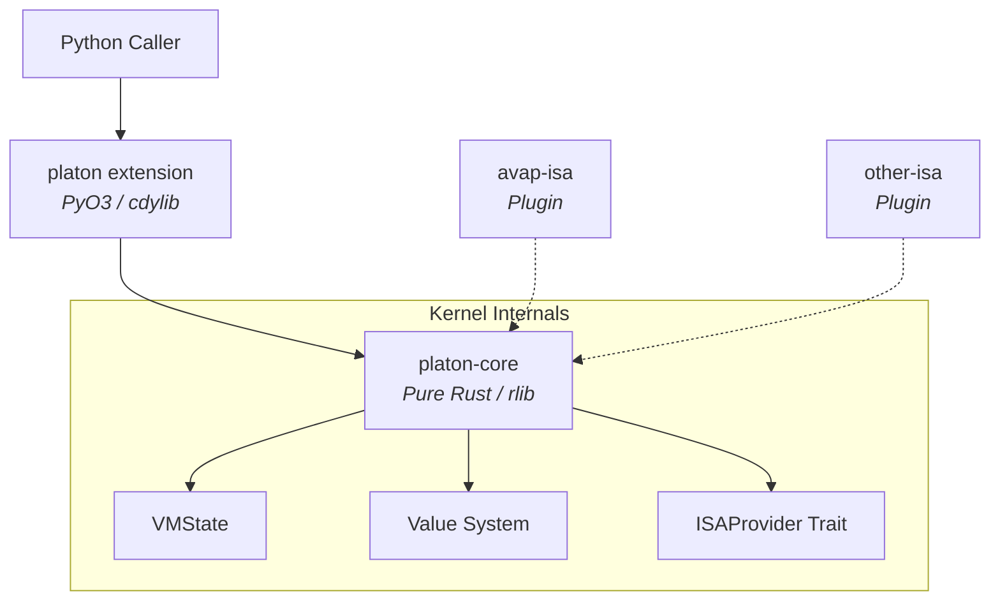

# Platon VM Kernel

Platon is a language-agnostic virtual machine kernel, written in Rust and exposed to Python via PyO3. It provides a safe, sandboxed, high-performance execution environment for bytecode programs.

## 🔥 Why is it Disruptive?

Platon solves a fundamental problem in modern language design: **enabling true virtuality for programming languages by allowing language definitions to be stored in external services and retrieved at runtime**.

### The Core Innovation: Language Virtuality
Traditional programming languages have their semantics hardcoded at compile time. Platon changes this paradigm:

- **External Language Definitions**: Language rules, instruction sets, and execution semantics can be defined in external services
- **Runtime Retrieval**: Language definitions are fetched and loaded dynamically at execution time
- **True Virtualization**: The same bytecode can behave differently based on the ISA (Instruction Set Architecture) plugin loaded
- **Service-Oriented Language Design**: Language evolution happens in services, not in client deployments

### Additional Benefits
✅ **Real Isolation**: Bytecode executes in a separate virtual machine with no direct access to the host's filesystem, network, or processes

✅ **Dual Security Limits**: 
   - Instruction count limit (precise, deterministic)
   - Wall-clock execution timeout

✅ **ISA Plugin System**: Interchangeable Instruction Set Architectures — language semantics can be swapped at runtime

✅ **Zero Garbage Collector Overhead**: All values are owned, no GC pauses

✅ **Language-Agnostic**: The kernel can execute bytecode from any language that compiles to AVBC

✅ **Rust + PyO3**: Memory-safe kernel + Python ease of use

## 🎯 Vision
Enable true language virtualization by providing a kernel where language definitions live in external services and are retrieved at runtime, eliminating the need for hardcoded execution semantics and enabling dynamic, service-driven language evolution.

## 🏗️ Architecture at a Glance



## 📚 Documentation

### Main Repository Documents

| Document | Description |
|----------|-------------|
| [**ARCHITECTURE.md**](ARCHITECTURE.md) | Complete system architecture, execution flows, memory model, and registry of all ADRs, PRDs, RFCs, and SPECs |
| [**ROADMAP.md**](ROADMAP.md) | Project roadmap, current status, and future plans |
| [**CHANGELOG.md**](CHANGELOG.md) | Change history and version releases |
| [**PERFORMANCE.md**](PERFORMANCE.md) | Benchmarks and performance considerations |
| [**SECURITY.md**](SECURITY.md) | Security policy and vulnerability reporting |
| [**UNSAFE.md**](UNSAFE.md) | Inventory and justification of all unsafe code |
| [**CONTRIBUTING.md**](CONTRIBUTING.md) | Contributor guidelines |
| [**CODE_OF_CONDUCT.md**](CODE_OF_CONDUCT.md) | Project code of conduct |

### Detailed Technical Documentation

For deeper insights into specific design aspects:

- **[Product Requirements (PRD)](docs/PRD/PRD-001-platon-kernel.md)**: Initial vision and technical requirements
- **[Architecture Decision Records (ADRs)](docs/ADR/README.md)**: 19 documents covering all key architectural decisions
- **[Requests for Comments (RFCs)](docs/RFCS/RFC-001-store-cvar-store-result.md)**: Proposals under discussion
- **[Specifications (SPECs)](docs/SPEC/)**: Technical specifications for bytecode, ISA, value types, and execution model

## 🚀 Quick Start (Development)

Requires Rust and Python 3.11+.

```bash
# Install maturin and develop locally
pip install maturin
maturin develop
```

---
© 2026 The Platon Foundation.