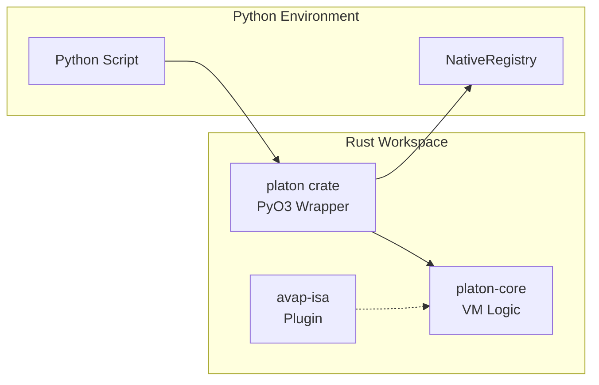
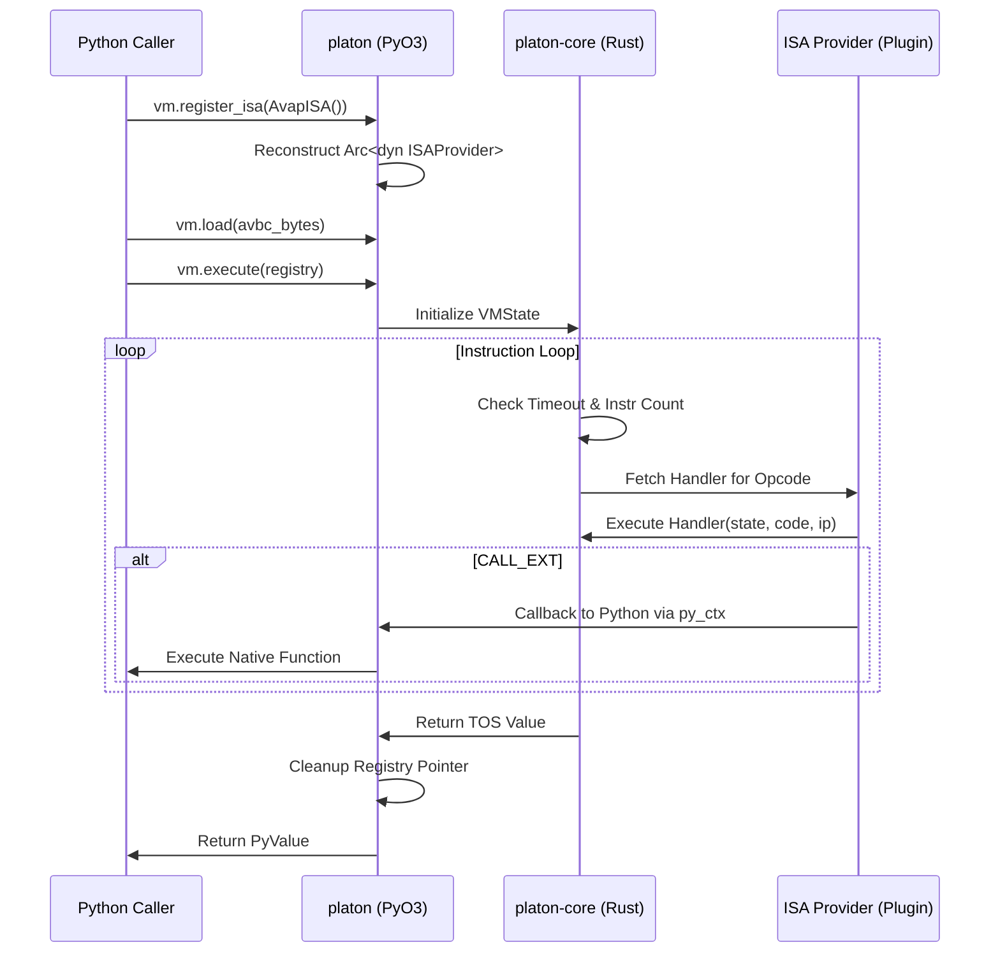

# PRD-001 — Platon VM Kernel

**Author:** Rafael Ruiz, CTO — The Platon Foundation
**Date:** 2026-03-22
**Status:** Implemented
**Version:** 0.3.0

---

## 1. Executive Summary

Platon is a language-agnostic virtual machine kernel written in Rust, exposed to Python via PyO3. It provides a safe, sandboxed, high-performance execution environment for compiled bytecode programs. The kernel defines no opcodes of its own — all execution semantics are provided by external Instruction Set Architecture (ISA) plugins registered at runtime via the `ISAProvider` trait.

The immediate motivation is eliminating Python `exec()` from the AVAP Language Server hot path. The long-term vision is a production-grade kernel that any language targeting the AVBC bytecode format can use as its execution substrate.

---

## 2. Problem Statement

### 2.1 The exec() Problem

The AVAP Language Server previously executed all API command logic by calling Python `exec()` on source code at request time. This has three compounding problems:

**Performance.** `exec()` re-parses and re-compiles Python source on every invocation. There is no bytecode caching, no ahead-of-time optimisation, and no instruction-level control over resource consumption.

**Security.** `exec()` with a controlled namespace provides shallow isolation at best. It is difficult to enforce CPU time limits, memory limits, or capability restrictions on code running inside `exec()`. A malicious or buggy command can leak state between executions via Python's reference semantics.

**Language lock-in.** The system is structurally tied to Python. Introducing a second language for command definitions requires running a separate interpreter, duplicating the runtime context model, and managing two execution paths with different failure modes.

### 2.2 The Desired State

- Commands are compiled to a well-defined bytecode format (AVBC) once, at deploy time
- Bytecode is executed by a Rust VM with enforced timeout and instruction limits
- The VM defines no opcodes — all semantics are pluggable via the ISA interface
- The system supports multiple languages simultaneously, each with its own ISA
- Full backwards compatibility during migration: both `exec()` and AVBC paths coexist

---

## 3. Goals

| ID | Goal | Priority |
|---|---|---|
| G-01 | Eliminate `exec()` from the hot execution path | P0 |
| G-02 | Provide a sandboxed execution environment with hard resource limits | P0 |
| G-03 | Define a stable bytecode format (AVBC) for compiled programs | P0 |
| G-04 | Implement the ISAProvider trait interface for language-agnostic dispatch | P0 |
| G-05 | Expose the kernel to Python via PyO3 with minimal API surface | P0 |
| G-06 | Keep `platon-core` free of PyO3 dependency | P1 |
| G-07 | Support CALL_EXT for ISAs that need to call back into Python | P1 |
| G-08 | Provide per-execution namespaces for conector variables and results | P1 |
| G-09 | Enable debug tracing of individual instruction execution | P2 |

---

## 4. Non-Goals

- JIT compilation
- Ahead-of-time native code generation
- Multi-threading within a single execution
- Memory isolation at OS level (e.g. seccomp, cgroups)
- WASM target in this version
- Garbage collection (all values are eagerly freed via Rust drop)

---

## 5. Requirements

### 5.1 Kernel Architecture

**REQ-001** The kernel must be split into two Rust crates within a Cargo workspace:
- `platon-core` — pure Rust `rlib`, no PyO3 dependency, contains `Value`, `VMState`, `ISAProvider`, `InstructionSet`
- `platon` — PyO3 `cdylib`, Python bindings only

**REQ-002** `platon-core` must be usable as a dependency by any Rust crate without pulling in Python symbols.

**REQ-003** The `ISAProvider` trait must be `Send + Sync` to allow `Arc<dyn ISAProvider>` across thread boundaries.

### 5.2 Value Type System

**REQ-010** The `Value` enum must support: `Null`, `Bool`, `Int` (i64), `Float` (f64), `Str` (String), `List` (Vec<Value>), `Dict` (Vec<(String, Value)>), `Iter` (Vec<Value>, usize).

**REQ-011** `Value` must be `Clone`. All value operations use copy semantics.

**REQ-012** Python-to-Value conversion must check `dict` before `list` to avoid extracting dicts as key-only lists.

**REQ-013** `Bool` and `Int` must be distinct — `Bool(true) != Int(1)` under `eq_val`.

### 5.3 Bytecode Format

**REQ-020** AVBC bytecode must have a fixed 128-byte header containing: magic `b"AVBC"`, ISA version (u16 LE), flags (u16 LE), code size (u32 LE), constant pool count (u32 LE), entry point (u32 LE), and 108 reserved bytes.

**REQ-021** The constant pool must precede the instruction stream in the file.

**REQ-022** `vm.load()` must reject bytecode with wrong magic, truncated header, or truncated constant pool.

### 5.4 Execution

**REQ-030** `vm.execute()` must enforce a wall-clock timeout, raising `TimeoutError` on expiry.

**REQ-031** `vm.execute()` must enforce a maximum instruction count, raising `VMError` on exceedance.

**REQ-032** The VM must require a registered ISA before `execute()` — calling `execute()` without `register_isa()` raises `VMError`.

**REQ-033** An unknown opcode must raise `VMError` with the opcode value and IP for diagnostics.

**REQ-034** ISA handler errors must raise `VMError` with the handler's error string.

**REQ-035** `vm.execute()` must return the top-of-stack value (or `Null` if empty) as a `Value`.

### 5.5 ISA Registration

**REQ-040** ISAs must be registered via `vm.register_isa(isa_obj)` where `isa_obj` is a Python object that implements `_get_arc_ptr() -> (u64, u64)`.

**REQ-041** The fat pointer `(u64, u64)` must encode an `Arc<dyn ISAProvider>` with refcount incremented.

**REQ-042** The kernel must reconstruct the `Arc` via `Arc::from_raw(transmute(ptrs))`.

### 5.6 State Access

**REQ-050** `vm.globals` must expose the full variable namespace as a Python dict after execution.

**REQ-051** `vm.conector_vars` must expose values written to the ISA conector namespace during execution.

**REQ-052** `vm.results` must expose values written to the ISA results namespace during execution.

**REQ-053** Setting `vm.globals = {...}` before `execute()` must inject the given variables into `VMState.globals`.

### 5.7 NativeRegistry

**REQ-060** `NativeRegistry` must map function IDs (u32) to Python callables.

**REQ-061** `NativeRegistry` must support dynamic attribute storage for runtime context (e.g. `registry.task = {...}`).

**REQ-062** The registry must be passed to `vm.execute(registry=...)` and made accessible to ISA `CALL_EXT` handlers via `VMState.registry_ptr`.

**REQ-063** `registry_ptr` must be freed (as `Py<PyDict>`) at the end of `execute()`, including on error paths.

---

## 6. Architecture Diagram

### 6.1 Component Layout

### 6.2 Execution Flow

---

## 7. Security Considerations

Platon provides **application-level sandboxing**, not OS-level isolation:

- Timeout and instruction limits prevent runaway execution
- `CALL_EXT` is the only escape hatch to Python — callers control what is registered
- `unsafe` is minimised to two well-documented locations (ISA fat pointer, registry cleanup)
- No filesystem, network, or OS access from inside the VM

For production deployments requiring stronger isolation, run each VM execution in a separate process or container.

---

## 8. Success Metrics

| Metric | Target | Status |
|---|---|---|
| exec() eliminated from hot path | 0 exec() calls per AVBC execution | ✅ |
| All 27 AVAP commands execute via AVBC | 27/27 | ✅ |
| platon-core has no PyO3 dependency | 0 PyO3 imports in platon-core | ✅ |
| ISA opcode hardcoding in kernel | 0 | ✅ |
| unsafe blocks documented with SAFETY comments | 100% | ✅ |

---

## 9. Roadmap

| Phase | Scope | Status |
|---|---|---|
| 1 — Foundation | Core types, AVBC format, execution loop, PyO3 bindings | ✅ Done |
| 2 — ISA Plugin | ISAProvider trait, fat pointer protocol, NativeRegistry | ✅ Done |
| 3 — Namespaces | conector_vars, results, marker routing | ✅ Done |
| 4 — Production | Pre-built wheels in CI, formal test suite, PyO3 0.22 | 🔜 Pending |
| 5 — Hardening | STORE_CVAR/STORE_RESULT opcodes, stack depth limit, Value::Bytes | 🔜 Pending |
| 6 — Multi-language | Second ISA implementation, ISA version negotiation | 🔜 Pending |
